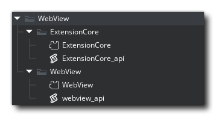

@title Setup

## Setting Up

Import the WebView extension folder with all subfolders into your project. Make sure to include the ExtensionCore subdirectory and all of its contents.



## Using in Fullscreen

The WebView can be used in fullscreen. This will work best when using borderless fullscreen ${function.window_enable_borderless_fullscreen}:

```gml
window_enable_borderless_fullscreen();
window_set_fullscreen(true);
webview_open_url("https://www.google.com");
webview_set_borderless(true);
```

